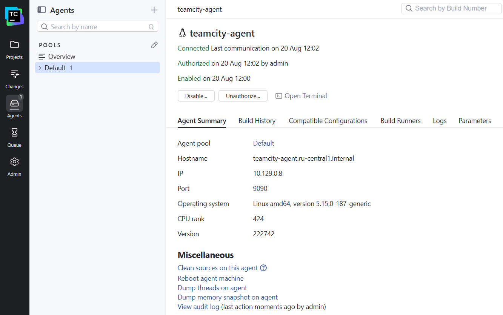
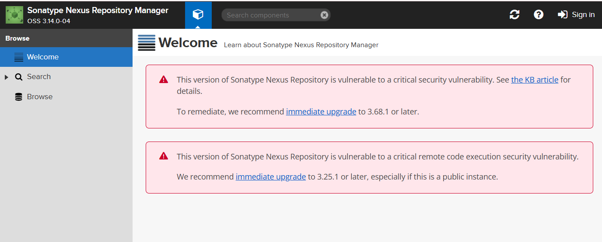
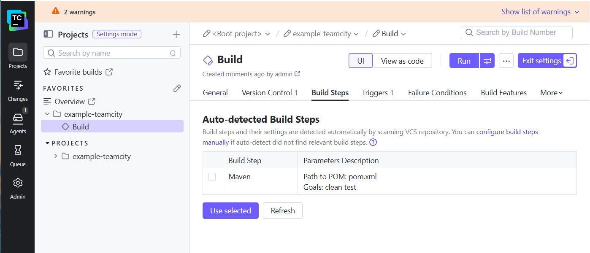
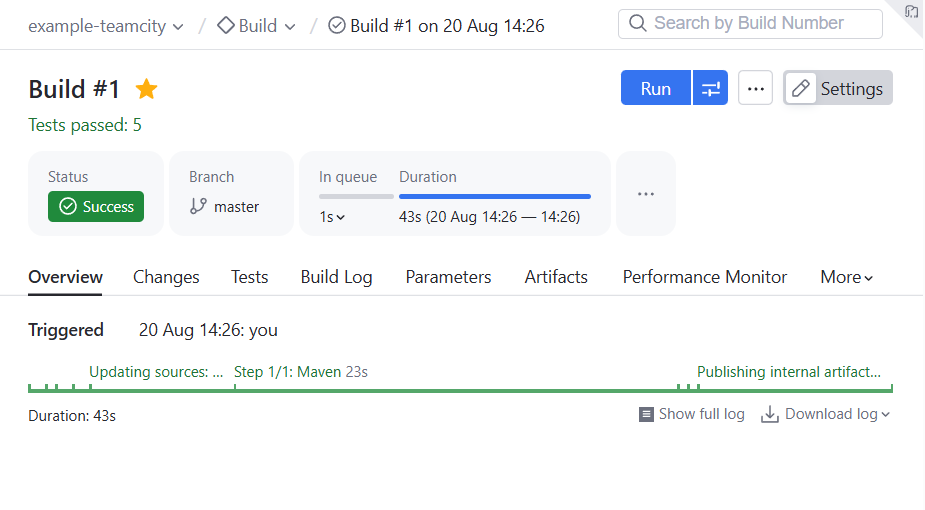
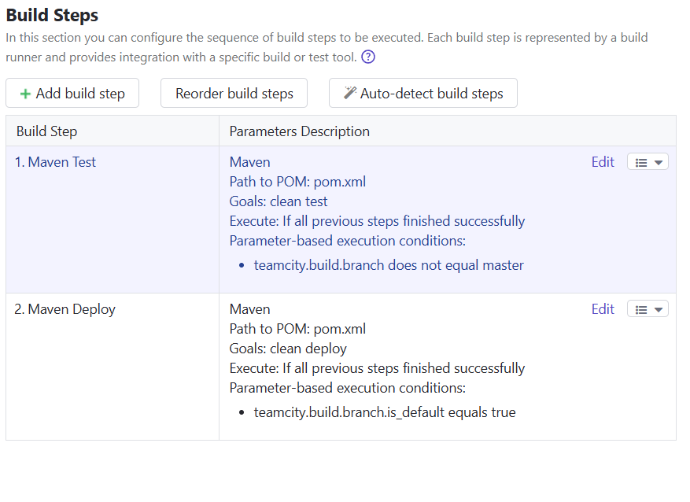
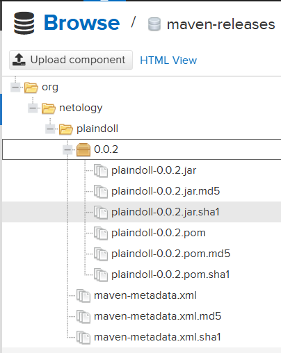
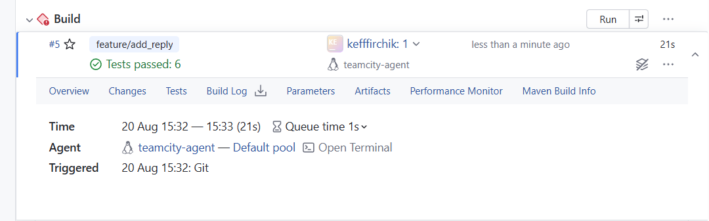
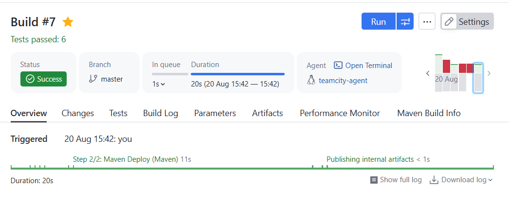
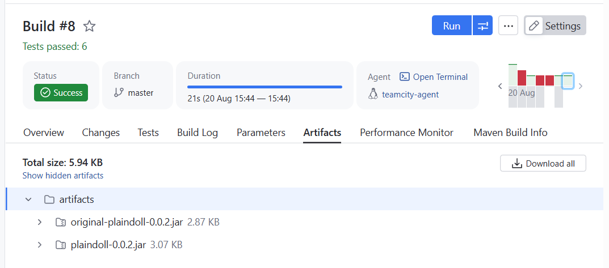

# Домашнее задание к занятию 11 «TeamCity»

Репозиторий с решением:\
https://github.com/kefffirchik/example-teamcity

## Подготовка инфраструктуры

Для выполнения задания в Yandex Cloud были созданы:

-   TeamCity Server --- 4 vCPU / 4 GB RAM;
-   TeamCity Agent --- 4 vCPU / 4 GB RAM;
-   Nexus Repository Manager --- 2 vCPU / 4 GB RAM.

TeamCity Server был запущен в Docker-контейнере:

``` bash
sudo docker run -d \
  --name teamcity-server \
  --restart always \
  -p 8111:8111 \
  jetbrains/teamcity-server
```

TeamCity Agent был запущен в Docker-контейнере с указанием адреса
сервера:

``` bash
sudo docker run -d \
  --name teamcity-agent \
  --restart always \
  -e SERVER_URL=http://<TEAMCITY_INTERNAL_IP>:8111 \
  jetbrains/teamcity-agent
```

Агент был успешно подключён и авторизован в TeamCity.



## Nexus

Для Nexus была создана отдельная VM на Rocky Linux 9.6.\
Установка выполнялась Ansible playbook из репозитория Netology:

``` bash
ansible-playbook -i inventory/cicd/hosts.yml site.yml
```

Для совместимости старого playbook с Rocky Linux SELinux был переведён в
permissive mode.

После запуска сервис Nexus успешно работал на порту `8081`.



В Nexus доступны репозитории:

-   `maven-central`;
-   `maven-public`;
-   `maven-releases`;
-   `maven-snapshots`.

## Создание проекта TeamCity

В TeamCity был создан проект на основе fork:

``` text
https://github.com/kefffirchik/example-teamcity.git
```

TeamCity автоматически определил Maven-проект и предложил build step:

``` text
Path to POM: pom.xml
Goals: clean test
```



Первая сборка ветки `master` завершилась успешно.



## Настройка сборки в зависимости от ветки

Были созданы два Maven build step.

### Maven Test

``` text
Goals: clean test
Condition: teamcity.build.branch does not equal master
```

### Maven Deploy

``` text
Goals: clean deploy
Condition: teamcity.build.branch.is_default equals true
```

Таким образом:

``` text
master        -> mvn clean deploy
other branch  -> mvn clean test
```



## Настройка Maven и Nexus

В TeamCity был загружен `settings.xml` с настройками доступа к Nexus:

``` xml
<server>
    <id>nexus</id>
    <username>admin</username>
    <password>admin123</password>
</server>
```

Для build step `Maven Deploy` был выбран набор Maven settings:

``` text
nexus-settings
```

В `pom.xml` адрес Nexus был изменён на актуальный:

``` xml
<distributionManagement>
    <repository>
        <id>nexus</id>
        <url>http://89.169.164.67:8081/repository/maven-releases</url>
    </repository>
</distributionManagement>
```

После запуска сборки `master` артефакт был успешно опубликован в Nexus:

``` text
org/netology/plaindoll/0.0.2
```

Файлы:

``` text
plaindoll-0.0.2.jar
plaindoll-0.0.2.pom
```



## Versioned Settings

Для проекта были включены TeamCity Versioned Settings в формате Kotlin.

В репозитории появился каталог:

``` text
.teamcity/
├── pluginData/
├── pom.xml
└── settings.kts
```

## Ветка `feature/add_reply`

Была создана отдельная ветка:

``` bash
git checkout -b feature/add_reply
```

В класс `Welcomer` добавлен новый метод:

``` java
public String sayReply(){
    return "Good hunter, the night is still young.";
}
```

Метод возвращает строку, содержащую слово `hunter`.

В `WelcomerTest` был добавлен тест:

``` java
@Test
public void welcomerSaysReply(){
    assertThat(welcomer.sayReply(), containsString("hunter"));
}
```

Изменения были закоммичены:

``` bash
git add src/main/java/plaindoll/Welcomer.java \
        src/test/java/plaindoll/WelcomerTest.java

git commit -m "Add hunter reply"
git push -u origin feature/add_reply
```

После push TeamCity автоматически запустил сборку ветки
`feature/add_reply`.

Результат:

``` text
Branch: feature/add_reply
Tests passed: 6
Status: Success
```



## Merge в master

Изменения из `feature/add_reply` были добавлены в `master` через Pull
Request и Merge.

В истории Git присутствует merge-коммит:

``` text
6199e61 Merge pull request #1 from kefffirchik/feature/add_reply
```

После merge TeamCity автоматически запустил сборку `master`.

Сборка выполняла:

``` text
Maven Deploy -> clean deploy
```

Успешная сборка `master` после настройки deploy:



Повторный deploy той же release-версии `0.0.2` сначала был отклонён
Nexus:

``` text
Repository does not allow updating assets: maven-releases
```

После удаления предыдущей версии `0.0.2` из `maven-releases` повторная
сборка завершилась успешно.

## Публикация JAR как TeamCity Artifact

В настройках Build Configuration был добавлен Artifact Path:

``` text
target/*.jar => artifacts
```

После повторной сборки `master` TeamCity опубликовал JAR-файлы как build
artifacts:

``` text
artifacts/
├── original-plaindoll-0.0.2.jar
└── plaindoll-0.0.2.jar
```



## Проверка конфигурации в репозитории

В `.teamcity/settings.kts` присутствуют все основные настройки build
configuration.

Проверка:

``` bash
grep -n -E "artifactRules|Maven Test|Maven Deploy|teamcity.build.branch|teamcity.build.branch.is_default" .teamcity/settings.kts
```

Результат:

``` text
37:    artifactRules = "target/*.jar => artifacts"
45:            name = "Maven Test"
49:                doesNotEqual("teamcity.build.branch", "master")
55:            name = "Maven Deploy"
59:                equals("teamcity.build.branch.is_default", "true")
```

Последние изменения в Git:

``` text
e3ffe28 general settings of 'Build' build configuration were updated
6199e61 Merge pull request #1 from kefffirchik/feature/add_reply
a6efc26 Add hunter reply
6a185a6 Synchronization with own VCS root is enabled
a10179c Update Nexus repository URL
```

Рабочее дерево чистое:

``` text
On branch master
Your branch is up to date with 'origin/master'.

nothing to commit, working tree clean
```

## Итог

В рамках задания были выполнены:

-   развёртывание TeamCity Server;
-   подключение и авторизация TeamCity Agent;
-   развёртывание Nexus;
-   создание TeamCity проекта на основе GitHub fork;
-   autodetect Maven build configuration;
-   настройка разных Maven goals для `master` и feature-веток;
-   настройка Maven `settings.xml`;
-   deploy артефакта в Nexus;
-   включение TeamCity Versioned Settings;
-   создание `feature/add_reply`;
-   добавление нового метода и теста со словом `hunter`;
-   автоматическая сборка feature-ветки;
-   merge feature-ветки в `master`;
-   публикация `.jar` как TeamCity build artifact;
-   проверка актуальной конфигурации в `.teamcity/settings.kts`.

Ссылка на репозиторий:

https://github.com/kefffirchik/example-teamcity
